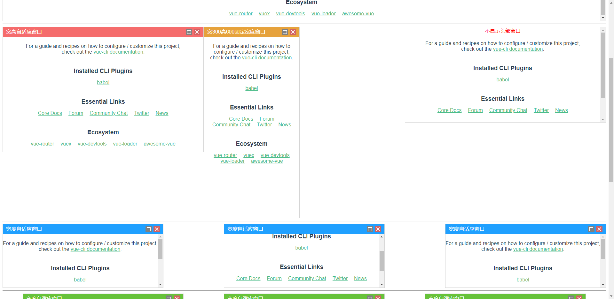
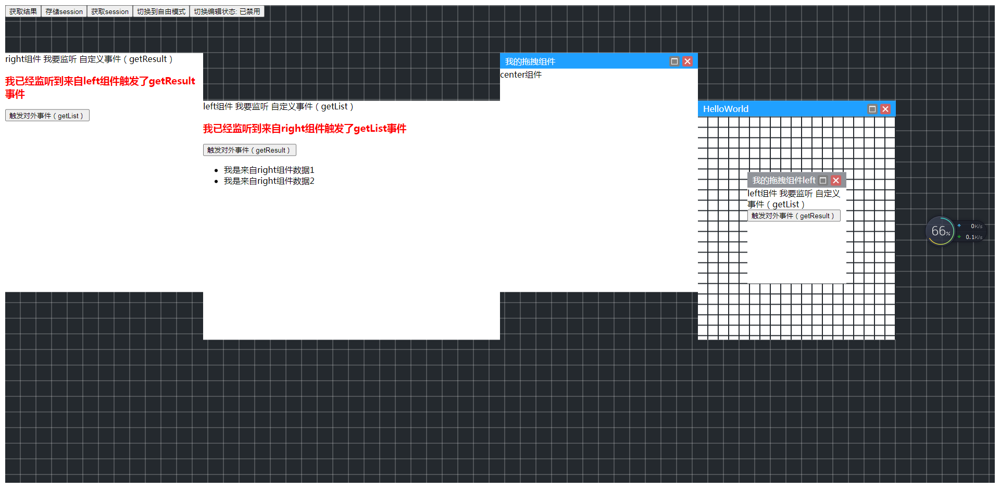

# vue-draggable-resizable-os

# description
基于vue-draggable-resizable 封装模拟云桌面可拖动窗口组件




### v2 新增vue-draggable-area组件
### 支持拖拽区域定义
### 支持拖拽组件百分比缩放
### 支持拖拽组件嵌套
### 支持拖拽组件自由拖拽 以及 组件拖拽交换模式
### 提供组件内部事件传递 参数传递


## Project setup
```
npm install -S vue-draggable-resizable-os
```

### Import and Use
```
import VueDraggableResizableOs from 'vue-draggable-resizable-os'
import 'vue-draggable-resizable-os/lib/vue-draggable-resizable-os.css'
Vue.use(VueDraggableResizableOs)

//如果组件中用到 vue-draggable-area
//那么data中的component 必须全局引入 才能正确使用

import HelloWorld from "./components/HelloWorld";
Vue.component('HelloWorld',HelloWorld)

data: [
    {
        id: '1',
        component: 'HelloWorld',
        ...
    }
]
```

### Make+  vue-draggable-resizable-os
```
<vue-draggable-resizable-os>
  ...组件
</vue-draggable-resizable-os>
```

### props
```
相对父级盒子
x: 初始化横坐标                           - Number
y: 初始化纵坐标                           - Number
width: 窗口宽度                          - Number
height: 窗口高度                         - Number
minWidth: 最小宽度                       - Number
minHeight: 最小高度                      - Number
parent: 是否限制在父级内                  - Boolean
title: 窗口名称                          - String
grid: 限制移动在网格间隙内                 - Array<number>
canDrag: 是否能拖拽                      - Boolean
canResize: 是否能调整大小                 - Boolean
fullscreen: 是否是全屏                   - Boolean
headerBg: 头部背景色                     - String
showHeader: 是否显示窗口头部              - Boolean
headerColor: 头部字体色                  - String
```

### events
```
dragstart               拖拽开始
dragstop                拖拽结束
resizestart             重置大小开始
resizestop              重置大小结束
fullscreen              全屏后
resizescreen            恢复全屏之前后
close                   关闭窗口后
outClick                点击窗口外
inClick                 点击窗口内
```

### 组件内的方法
```
toggleEditing(type)   切换可拖拽重置大小  type: Boolean
getValue              获取组件的属性
```

### Make+  vue-draggable-area
```
<!-- 确保包裹div要有width height -->
<div style='width: 100%;height:800px;'>
    <vue-draggable-area></vue-draggable-area>
</div>
```

### props

#### data
Type: `Array<object>`<br>
Required: `true`<br>
Default: `[]`

拖拽区域内部的组件列表 <br>

内部对象：{ <br>
    id: '1',                     `列表id唯一；必须` <br>
    component: 'HelloWorld',     `内部组件名；必须` <br>
    title: 'HelloWorld',         `头部名称；必须`
    width: 0.2,                  `width，相对于拖拽区域的宽比；必须`<br>
    height: 0.5,                 `height，相对于拖拽区域的高比；必须`<br>
    x: 0.7,                      `x,组件横坐标：拖拽区域宽；必须`<br>
    y: 0.2,                      `y,组件纵坐标：拖拽区域高；必须`<br>
    headerBg: '#20a0ff',         `头部背景色`<br>
    headerColor: '#ffffff',      `头部字体色`<br>
    exchangeBorder: '2px dashed red'   `组件交换模式时，内部边框的样式`<br>
} <br>

```html
<vue-draggable-area :data="[{...}]">
```

#### gridBg
Type: `Array<string>`<br>
Required: `false`<br>
Default: `["rgba(255,255,255,0.2)",30,"rgba(36,41,46,1)"]`<br>

定义拖拽网格样式 <br>

参数1：  网格线条色  <br>
参数2：  线条宽高间隙  <br>
参数3：  背景色  <br>

```html
<vue-draggable-area :gridBg='["rgba(255,255,255,0.2)",30,"rgba(36,41,46,1)"]'>
```

#### model 
Type: `Boolean`<br>
Required: `false`<br>
Default: `false` <br>

定义拖拽的模式：`false`自由模式 ,`true` 交换模式 <br>

```html
<vue-draggable-area :model='false'>
```

#### canEdit
Type: `Boolean`<br>
Required: `false`<br>
Default: `true` <br>

定义是否可编辑：`false`不能编辑 ,`true` 能编辑 <br>

```html
<vue-draggable-area :canEdit='true'>
```


### events
```
dragstop                拖拽结束
resizestop              重置大小结束
fullscreen              全屏后
resizescreen            恢复全屏之前后
close                   关闭窗口后
modelChange             拖拽模式改变后
```

#### dragstop

Required: `false`<br>
Parameters:
* `id` 拖拽元素id
* `list` 拖拽结束后列表数据

每当组件拖动结束时调用。

```html
<vue-draggable-area @dragstop="onDragstop">
```

#### resizestop

Required: `false`<br>
Parameters:
* `id` 改变大小元素id
* `list` 改变大小结束后列表数据

每当组件停止调整大小时调用。

```html
<vue-draggable-area @resizestop="onResizestop">
```

#### close

Required: `false`<br>
Parameters:
* `id` 删掉的元素id
* `list` 删掉结束的后表数据

每当组件停止调整大小时调用。

```html
<vue-draggable-area @close="onClose">
```

#### fullscreen

Required: `false`<br>
Parameters:
* `id` 全屏元素id

每当组件全屏后调用。

```html
<vue-draggable-area @fullscreen="onFullscreen">
```

#### resizescreen

Required: `false`<br>
Parameters:
* `id` 从全屏恢复原大小元素id

每当组件从全屏恢复后调用。

```html
<vue-draggable-area @resizescreen="onResizescreen">
```

#### modelChange

Required: `false`<br>
Parameters:
* `type` 拖拽自由模式 和 交换模式 改变的状态

每当组件拖拽模式改变后调用。

```html
<vue-draggable-area @modelChange="onModelChange">
```


### 组件内的方法
```
getValue              获取组件的属性
```